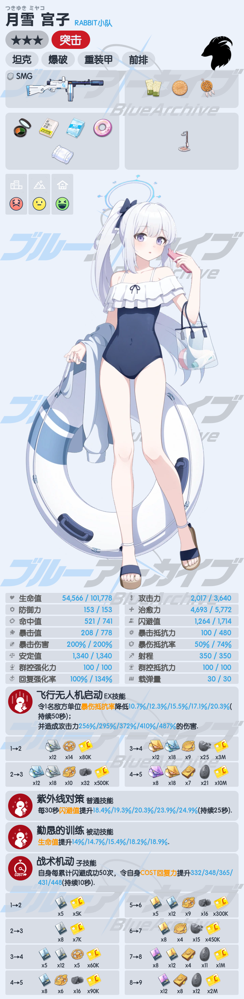

# BlueArchive

一个奇怪的蔚蓝档案(BA/碧蓝档案)库, 提供查询学生信息的API, 用 `sharp.js` 合成各种图片.

[](https://www.npmjs.com/package/blue-archive)

当前计划/实现:

- [x] 动态更新数据
- [x] 获取学生资料
- [x] momotalk
- [x] 资料卡
- [ ] 模拟抽卡(咕咕咕)
- [ ] 关卡资料(大概不会做)

所有图片合成功能返回的都是 `sharp` 创建的实例, `Sharp` 继承了 `Duplex`, 因此你可以使用基于流的数据操作.

## Installation

```sh
# using npm
npm i -S blue-archive
# using yarn
yarn add blue-archive
```

安装后会自动运行一次数据更新脚本, 数据是从 github 获取的, 因此你需要保证 github 可用. `axios` 代理可通过环境变量实现

```sh
export ALL_PROXY=http://127.0.0.1:1080
```

后续数据更新需要手动进行:

```js
const { syncData } = require('blue-archive')
// 传入一个函数的话, 可以获取一些记录, 返回值是总耗时(ms)
const costTime = await syncData((...info) => console.log('Update process:', ...info))
console.log(`Update cost ${costTime} ms`)
```

> 进行其他操作前, 你需要保证至少成功运行过一次更新脚本, 否则可能会缺少某些资源导致报错

## `students`

可以方便地搜索、获取学生的资料

`Student` 对象的定义参考 [types/student.d.ts](types/student.d.ts)

```js
const { students } = require('blue-archive')
students.queryByName('aru') // 返回数组
students.getById(10000) // 返回 Student 对象
students.getById(10000, 'jp') // 返回日语数据(默认语言为'cn')
```

搜索忽略大小写, 对各语言按照 `cn => jp => en => tw => kr => th => vi` 顺序依次搜索, 在内部优先精准匹配(`===`) `Name/PathName/DevName`, 然后模糊匹配(`includes`) `Name/PathName/DevName/FamilyName/PersonalName/CharacterVoice`

> 以 `水` 开头的查询, 如果没有匹配的对象则会改为搜索泳装

## `momotalk`

支持对话&选项&羁绊剧情(根据国服翻译为 `好感故事` ), 支持插入图片

```js
const { momotalk, students } = require('blue-archive')
const { resolve } = require('path')

// 使用文本构建对话
const talks =
  // 学生名+空格+对话内容, 学生名支持模糊搜索
  '/S 白子 vvv\n' +
  // 支持多行内容, 每行一个对话气泡, 只有第一行上会显示头像/名字
  '测试测试\n' +
  // [img:index] 用于图片占位的 tag，后面会传入图片列表
  // 注意下标是从 1 开始的, 这是为了方便非专业用户(比如 QQ 机器人用户)使用
  '[img:1]\n' +
  // 可以搜索CV, 小仓唯会匹配到 1.白子/2.白子(单车), 这时可以用编号精准选择
  '/S 小仓唯1 111111\n' +
  '/S 藤田咲 ¿\n' +
  // 老师的对话，显示在右侧
  '/T 嗯？\n' +
  '嗯嗯嗯？\n' +
  // 选项, 每行一个
  '/O 嗯？\n' +
  '嗯嗯？\n' +
  '嗯嗯嗯？\n' +
  // 羁绊剧情, 可以空格+文字修改羁绊剧情按钮的文本, 文本超长的话会自动换行
  '/K aru\n' +
  '/K 响 进入响的小孩子看了根本把持不住的好感故事\n'

// 从文本构建消息链
const result = momotalk.textToMessages(talks)
// 解析出错时错误信息会存放到 errors 里
if (result.error) {
  // { error: true, errors: string[] }
  return console.error(result.errors.join('\n'))
}

// 用于替换占位([img:index])的图片, 可以是文件路径或图片的 Buffer/Stream
// 支持大部分图片格式, 也支持svg, 但要作为文件/Buffer/Stream传入, 字符串只会识别为路径
// 如果图片不可用, 占位的 tag 会被忽略
const images = [
  resolve(__dirname, 'assets/icons/Student_Portrait_Airi_Collection.png'),
  // fs.readFileSync(somepath) => Buffer
  // fs.createReadStream(somepath) => ReadStream
  // Buffer.from('<svg>...</svg>')
]
/**
 * result.messages 是格式化好的对话, 你也可以直接构建对话
 */
const messages = [{
  type: 'student',
  student: students.queryByName('白子')[0],
  // 多行文本每行会单独使用一个对话气泡
  content: 'vvv\n测试测试',
}, {
  type: 'student',
  student: students.getById(10010),
  content: '11111'
}, {
  type: 'teacher',
  content: '22222'
}, {
  type: 'option',
  // 选项使用数组时可以在内部换行, 使用字符串时则会根据换行拆分选项
  content: ['选项1', '选项2\n……？']
}, {
  type: 'student',
  // 你可以自己构建一个对象
  student: {
    Name: '初音未来',
    // 如果提供了 DisplayName 则会优先显示此名字
    DisplayName: 'Miku',
    // 使用 Icon 指定头像, 可以是路径或 Buffer/Stream
    Icon: resolve(__dirname, 'assets/icons/Student_Portrait_CH9999_Collection.png'),
  },
  // 图片会自己占用一个气泡, 换不换行都可以
  content: '¿[img:1]'
}, {
  type: 'kizuna',
  student: {
    Name: '初音未来',
    DisplayName: 'Miku'
  },
  // 留空会使用 `进入${student.DisplayName || student.Name}的好感故事`
  content: ''
}]
/**
 * 合成图片返回结果是 composite 过的 `sharp` 实例, 你可以继续调用
 * `sharp` 的其他 API 进行图片处理, 也可以按需要保存/发送图片
 */
const image = await momotalk.build(
  result.messages,
  images,
  'https://github.com/RedBeanN/BlueArchive', // 图片底部的水印，留空不添加
)
await image.toFile(resolve(__dirname, 'test.png')) // 保存为文件
await image.toBuffer() // 转化为 Buffer, 可用于直接发送到各机器人框架
// 如果你使用 `node-mirai-sdk` 或其他支持 `Stream` 的框架, 你可以
bot.sendImageMessage(image, Group(123))
```


<details>
<summary>高级用法</summary>

### 设置

目前可以设置的内容有 `Momotalk顶部标题` `标题背景颜色` `图标` `回复标题` `羁绊标题`

```js
const { momotalk } = require('blue-archive')
// 以下为默认配置
momotalk.setConfig({
  title: 'MomoTalk',
  titleBackground: '#fa97ab',
  titleIcon: Buffer.from('<svg ...>'),
  kizunaTitle: '好感故事',
  optionTitle: '回复',
})
```

### 自定义学生

对话列表的 `student` 值只要有 `Name` 和 `CollectionTexture` / `Icon` 之一就可以被识别, `CollectionTexture` 是内置的数据自带的, 会自动搜索对应的路径.

你可以自行添加更多学生(其他游戏的角色/群友等), 只需要添加 `{ Name, Icon }` 对象作为额外的数据.

> 如果你需要搜索别名但显示正式名, 可以使用 `{ Name: '别名', DisplayName: '正式名', Icon }`.
> 你可以添加多个别名来帮助匹配到正确的角色, 也可以用 `DisplayName` 来修改显示在图片上的名字.

```js
const specialStudents = [{
  Name: '巧克力',
  Icon: '/path/to/巧克力.png' // 同样可以是 Buffer/Stream
}, {
  Name: '香子兰',
  Icon: '/path/to/香子兰.png'
}]
// 如果使用文本构建, 你需要告诉 `momotalk.textFromMessages`, 重名时 `specialStudents` 会被优先选择
const result = momotalk.textFromMessages(talks, specialStudents)
// 自己构建对话时, 作为 `student` 传入即可
const messages = [{
  type: 'student',
  student: {
    Name: '群主',
    Icon: '群主头像'
  },
  content: '我准备女装了！'
}]
// 之后正常生成图片
const png = await momotalk.build(messages)
// ...

```

如果你需要生成多次自定义学生的图片, 你可以使用 `customStudents` 加载学生列表
```js
const { customStudents } = require('blue-archive')
customStudents.load([{
  Name: '巧克力',
  Icon: '/path/to/巧克力.png' // 同样可以是 Buffer/Stream
}, {
  Name: '香子兰',
  Icon: '/path/to/香子兰.png'
}])

// 查看已有的学生
const myStudents = customStudents.get()
// 这个数组可以直接增删改查
myStudents.splice(0)

```

之后再生成图片时, 就不需要每次都传入这个数组了

注意这样做会使 `students.queryByName` 优先查询到自定义学生, 你需要自行处理重名问题和过滤查询结果. 为了避免查询到自定义学生, 你可以使用 `{ Name: uuid(), DisplayName: '名字', Icon }`.
</details>

## 生成资料卡

```js
const { createWriteStream } = require('fs')
const { resolve } = require('path')
const { students } = require('blue-archive')
const miyakoSwimsuit = student.getById(10071)
const card = await student.generateCard(
  miyakoSwimsuit,
  'cn', // 文本选用的服务器, 默认中文
)
await card.toFile(resolve(__dirname, 'miyako.png')) // 保存为文件
await card.jpeg().toFile(resolve(__dirname, 'miyako.jpg')) // 保存为体积更小的jpg
await card.toBuffer() // 转化为 Buffer, 可用于直接发送到各机器人框架
card.pipe(createWriteStream(resolve(__dirname, 'miyako.png'))) // 使用流式读写
```



## 数据来源

[SchaleDB](https://github.com/lonqie/SchaleDB)
