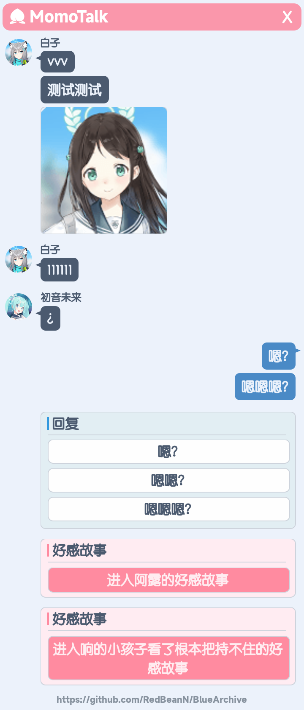

# BlueArchive

一个奇怪的蔚蓝档案(BA)库, 用 `sharp.js` 合成各种奇怪的图片.

当前计划/实现:

- [ ] 动态更新数据
- [x] 获取学生资料
- [x] momotalk
- [ ] 资料卡(懒)
- [ ] 模拟抽卡(咕咕咕)
- [ ] 关卡资料(大概不会做)

## `students`

可以方便地搜索、获取学生的资料

`Student` 对象的定义参考 [types/student.d.ts](types/student.d.ts)

```js
const { students } = require('blue-archive')
students.queryByName('aru') // 返回数组
students.getById(10000) // 返回 Student 对象
students.getById(10000, 'jp') // 返回日语数据(默认语言为'cn')
```

搜索忽略大小写, 对各语言按照 `cn => jp => en => tw => kr => th => vi` 顺序依次搜索, 在内部优先精准匹配(`===`) `Name/PathName/DevName`, 然后模糊匹配(`includes`) `Name/PathName/DevName/FamilyName/PersonalName/CharacterVoice`

## `momotalk`

支持对话&选项&羁绊剧情(根据国服翻译为 `好感故事` ), 支持插入图片

```js
const { momotalk, students } = require('blue-archive')
const { resolve } = require('path')

// 直接构建对话
const messages = [{
  type: 'student',
  student: students.queryByName('白子')[0],
  // 多行文本每行会单独使用一个对话气泡
  content: 'vvv\n测试测试',
}, {
  type: 'student',
  student: students.getById(10010),
  content: '11111'
}, {
  type: 'teacher',
  content: '22222'
}, {
  type: 'option',
  // 选项使用数组时可以在内部换行, 使用字符串时则会根据换行拆分选项
  content: [
    '选项1',
    '选项2\n……？',
  ]
}, {
  type: 'kizuna',
  student: students.getById(20007),
  // 留空会使用 `进入${student.Name}的好感故事`
  content: ''
}]
// 也可以使用文本构建对话
const talks =
  // 学生名+空格+对话内容, 学生名支持模糊搜索
  '/S 白子 vvv\n' +
  // 支持多行内容, 每行一个对话气泡, 只有第一行上会显示头像/名字
  '测试测试\n' +
  // [img:index] 用于图片占位的 tag，后面会传入图片列表
  '[img:1]\n' +
  // 可以搜索CV, 小仓唯会匹配到 1.白子/2.白子(单车), 这时可以用编号精准选择
  '/S 小仓唯1 111111\n' +
  // CV只配了一个角色时可以精准匹配到
  '/S 藤田咲 ¿\n' +
  // 老师的对话，显示在右侧
  '/T 嗯？\n' +
  '嗯嗯嗯？\n' +
  // 选项, 每行一个
  '/O\n 嗯？\n' +
  '嗯嗯？\n' +
  '嗯嗯嗯？\n' +
  // 羁绊剧情, 可以空格+文字修改羁绊剧情按钮的文本
  '/K aru\n' +
  // 文本超长的话会自动换行
  '/K 响 进入响的小孩子看了根本把持不住的好感故事\n'

const result = momotalk.textToMessages(talks)
// 解析出错时错误信息会存放到 errors 里
if (result.error) {
  // { error: true, errors: string[] }
  return console.error(result.errors.join('\n'))
}

// 用于替换占位的图片, 可以是文件路径或图片的 Buffer/Stream
// 如果图片不可用, 占位的 tag 会被忽略
const images = [
  resolve(__dirname, 'assets/icons/Student_Portrait_Airi_Collection.png'),
  // fs.readFileSync(somepath) => Buffer
  // fs.createReadStream(somepath) => ReadStream
]
/**
 * result.messages 是格式化好的对话, 类型信息可参考 `types` 文件夹
 * {
 *  type: 'student'|'teacher'|'option'|'kizuna'
 *  student?: Student,
 *  content: string|string[]
 * }
 */
const png = await momotalk.build(
  result.messages,
  images,
  'https://github.com/RedBeanN/BlueArchive', // 图片底部的水印，留空不添加
)
await png.toFile(resolve(__dirname, 'test.png')) // 保存为文件
await png.toBuffer() // 转化为 Buffer, 可用于直接发送到各机器人框架
```



<details>
<summary>高级用法</summary>

### 设置标题文字

目前可以设置的内容有 `Momotalk顶部标题` `回复标题` `羁绊标题`

```js
const { momotalk } = require('blue-archive')
momotalk.setConfig({
  title: 'MomoTalk',
  kizunaTitle: '好感故事',
  optionTitle: '回复'
})
```

### 自定义学生

对话列表的 `student` 值只要有 `Name` 和 `CollectionTexture` / `Icon` 之一就可以被识别, `CollectionTexture` 是内置的数据自带的, 会自动搜索对应的路径.

你可以自行添加更多学生(其他游戏的角色/群友等), 只需要添加 `{ Name, Icon }` 对象作为额外的数据.

```js
const specialStudents = [{
  Name: '巧克力',
  Icon: '/path/to/巧克力.png' // 同样可以是 Buffer/Stream
}, {
  Name: '香子兰',
  Icon: '/path/to/香子兰.png'
}]
// 如果使用文本构建, 你需要告诉 `momotalk.textFromMessages`, 重名时 `specialStudents` 会被优先选择
const result = momotalk.textFromMessages(talks, specialStudents)
// 自己构建对话时, 作为 `student` 传入即可
const messages = [{
  type: 'student',
  student: {
    Name: '群主',
    Icon: '群主头像'
  },
  content: '我准备女装了！'
}]
// 之后正常生成图片
const png = await momotalk.build(messages)
// ...

```

如果你需要生成多次自定义学生的图片, 你可以使用 `customStudents` 加载学生列表
```js
const { customStudents } = require('blue-archive')
customStudents.load([{
  Name: '巧克力',
  Icon: '/path/to/巧克力.png' // 同样可以是 Buffer/Stream
}, {
  Name: '香子兰',
  Icon: '/path/to/香子兰.png'
}])

// 查看已有的学生
const myStudents = customStudents.get()
// 这个数组可以直接增删改查
myStudents.splice(0)

```

之后再生成图片时, 就不需要每次都传入这个数组了

注意这样做会使 `students.queryByName` 优先查询到自定义学生, 你需要自行处理重名问题和过滤查询结果
</details>
